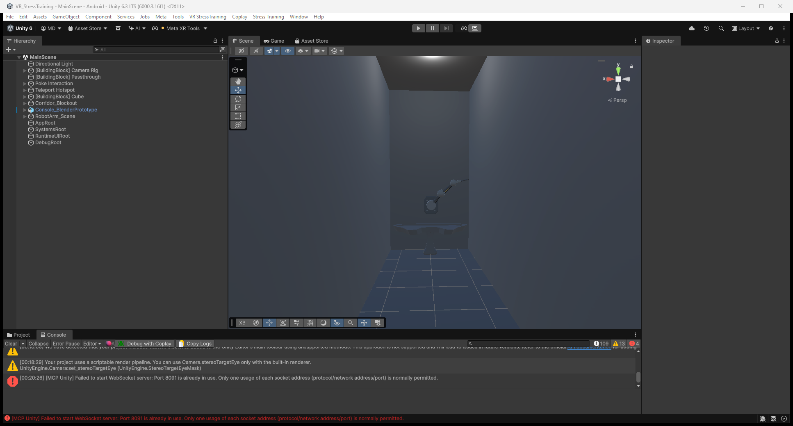
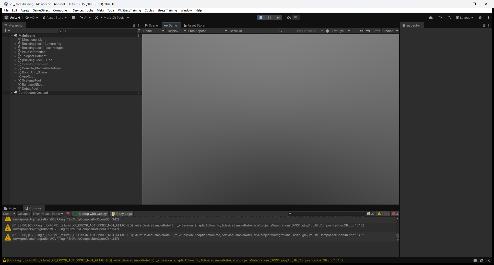

# XR Usability Fix Report

Datum provjere: 2026-07-13  
Unity: 6000.3.16f1, Android target  
Opseg: postojeći vertical slice; nijesu dodavani Go/No-Go, Flanker, pressure niti Blender asseti.

## Rezultat

Implementirani su deterministička orijentacija World Space UI-ja, standardni Meta XR/uGUI ray event tok i lokalno anchorovan placeholder raspored konzole. Svježa Unity kompilacija završila je za 16.788 s bez C# compile grešaka. Play Mode je pokrenut i `AppBootstrapper` je inicijalizovao vertical slice bez managed izuzetaka.

Quest/HMD nije bio aktivno priključen tokom završne provjere. OpenXR je prijavio `XR_ERROR_ACTIONSET_NOT_ATTACHED`, pa vizuelni HMD test čitljivosti, hovera i trigger klika ostaje za ručnu provjeru sa Quest Linkom.

## Uzrok izvrnutog i ogledalskog UI-ja

Unity World Space Canvas prikazuje čitljivu prednju stranu prema svom lokalnom `-Z` pravcu. SafeSpace UI anchor bio je postavljen ispred korisnika na lokalnom `+Z`, ali je dodatno rotiran `180°` oko Y ose. Time je `transform.forward` pokazivao nazad prema korisniku i korisnik je gledao poleđinu Canvas-a, što je davalo ogledalski tekst. XR rig nije rotiran.

Ispravka:

- SafeSpace anchor više nema pogrešnu Y rotaciju.
- `WorldSpaceUiOrientation` računa horizontalni camera/spawn forward, postavlja panel ispred korisnika i čuva uspravan `Vector3.up`.
- `UIManager` ponovo poravnava glavni Canvas pri promjeni zone.
- SafeSpace, Corridor, profile, progress, pause i summary paneli koriste isti glavni Canvas/orientation tok.
- Tablet se poravnava svojom čitljivom stranom prema očekivanoj poziciji korisnika u Corridor zoni.
- EditMode test provjerava poziciju, uspravnost i čitljivu stranu bez negativnog XY scale-a.

## XR UI komponente i mapping

Korišćen je postojeći Meta XR/uGUI tok, bez sopstvenog sistema za generisanje klikova:

- `EventSystem` sa isključenim `sendNavigationEvents` za sprečavanje duplog controller navigation događaja;
- `OVRInputModule` kao jedini aktivni `BaseInputModule`;
- `OVRRaycaster` na World Space Canvas-u;
- `OVRPhysicsRaycaster` na `OVRCameraRig` za fizičke kontrole;
- desni `rightControllerAnchor` kao ray transform;
- `OVRInput.Button.SecondaryIndexTrigger` kao click/submit;
- `LineRenderer` i mali cursor služe isključivo za prikaz zrake/pogotka i ne emituju klikove;
- pravi uGUI `Button` na redovima menija daje normal/hover/pressed vizuelna stanja;
- keyboard ostaje Editor fallback;
- A/B i thumbstick polling su isključeni kao glavni headset UI tok, čime nema drugog A/B klika uz trigger.

Controller mapping:

| Kontrola | Funkcija |
|---|---|
| Desni kontroler | UI ray origin/direction |
| Desni index trigger | uGUI pointer click / fizički pointer click |
| A/B | Nije paralelni menu submit tokom ray UI rada |
| Thumbstick | Opciono; nije primarna navigacija |
| Keyboard | Samo Editor fallback |

## Konzola

Aktivni shell je `Console_BlenderPrototype`. Installer je u `MainScene.unity` serijalizovao stvarni `ConsoleControlsAnchor` kao njegov dodati child, sa Editor-only gizmo komponentom. Runtime layout se gradi isključivo u lokalnom prostoru anchora; apsolutne world pozicije su uklonjene.

```text
Console_BlenderPrototype
└── ConsoleControlsAnchor
    └── ConsoleControlsRoot                 (runtime)
        ├── Task_Match
        ├── Task_NoMatch
        ├── Task_Confirm
        ├── Task_Left
        ├── Task_Right
        ├── Demo_CentralButton
        ├── Demo_Toggle
        ├── Demo_Lever
        ├── Demo_Knob
        ├── Indicator_1
        ├── Indicator_2
        ├── Indicator_3
        └── Distractor_1 ... Distractor_4
```

Svaka runtime kontrola ima primitive bazu, imenovani pokretni dio, collider, hover i pressed boju, stabilnu lokalnu poziciju i statusnu boju. Samo `Task_Match` i `Task_NoMatch` imaju task binding. Sve ostale kontrole su demonstracione/distraktori i ne šalju n-back odgovor. Debounce u `ConsoleControlBase` dozvoljava jednu aktivaciju po pritisku.

`ConsoleLayoutConfig`, serijalizovan u `AppBootstrapper`, izlaže lokalnu poziciju/rotaciju anchora i lokalnu poziciju svake kontrole za dalje ručno podešavanje.

## Promijenjeni fajlovi

- `Assets/Scenes/MainScene.unity`
- `ProjectSettings/McpUnitySettings.json` (MCP 8092, timeout 120 s zbog stale 8091 listenera)
- `Assets/Scripts/Core/AppBootstrapper.cs`
- `Assets/Scripts/Session/SafeSpaceBuilder.cs`
- `Assets/Scripts/Session/SceneZoneController.cs`
- `Assets/Scripts/Session/SessionCoordinator.cs`
- `Assets/Scripts/UI/WorldSpaceUiOrientation.cs`
- `Assets/Scripts/UI/UIManager.cs`
- `Assets/Scripts/UI/UiNavigationInput.cs`
- `Assets/Scripts/UI/MenuPanelBase.cs`
- `Assets/Scripts/UI/QuestRayUiSystem.cs`
- `Assets/Scripts/Tablet/TabletDisplayController.cs`
- `Assets/Scripts/Console/ConsoleLayoutBuilder.cs`
- `Assets/Scripts/Console/ConsoleControlBase.cs`
- `Assets/Scripts/Editor/StressTrainingSceneInstaller.cs`
- `Assets/Scripts/Tests/EditMode/WorldSpaceUiOrientationTests.cs`
- `Assets/Scripts/Tests/PlayMode/VerticalSliceSmokeTests.cs`

## Screenshotovi

### Prije

Ovo je editor-state snimak napravljen prije XR usability izmjena. Ne predstavlja pouzdan HMD dokaz ogledalskog teksta jer je Scene view, ali čuva početno stanje scene i konzole.



### Poslije

Play Mode je aktivan, `AppBootstrapper` je inicijalizovan i runtime `DontDestroyOnLoad` postoji. Game view je siv zato što Quest/OpenXR action set nije priključen u ovoj sesiji; zato screenshot nije označen kao vizuelni HMD prolaz.



## Compile i Play Mode status

- Unity script compile: **PASS**, 16.788 s, bez `error CS` zapisa.
- Scene installer: **PASS**; `ConsoleControlsAnchor` i gizmo su serijalizovani, scena sačuvana, backup napravljen.
- Play Mode bootstrap: **PASS**; vertical slice inicijalizovan bez `NullReferenceException`, `MissingReferenceException` ili `ArgumentException`.
- XR runtime bez HMD-a: **PARTIAL**; OpenXR javlja `XR_ERROR_ACTIONSET_NOT_ATTACHED`.
- EditMode/PlayMode Test Runner: nije ponovo izvršen kroz MCP jer bridge registruje/lista tools, ali tool pozivi i dalje timeout-uju; prethodna statička C# kompilacija test assembly-ja je prošla.

## Ručna provjera

| # | Provjera | Status |
|---|---|---|
| 1 | Korisnik se pojavljuje uspravno u SafeSpace-u | Čeka Quest Link/HMD |
| 2 | Panel je ispred korisnika | Implementirano; čeka HMD vizuelnu potvrdu |
| 3 | Tekst nije ogledalski | Root cause ispravljen i validator dodat; čeka HMD potvrdu |
| 4 | Desni controller ray vidi profile options | Konfigurisan; čeka HMD |
| 5 | Hover radi | uGUI hover stanje implementirano; čeka HMD |
| 6 | Trigger click radi | OVR secondary index trigger mapiran; čeka HMD |
| 7 | Nema duplog unosa | Jedan OVR input modul + controller submit isključen; čeka HMD potvrdu |
| 8 | Konzola je vezana za shell | **PASS**, scena i runtime hijerarhija |
| 9 | Kontrole ostaju na mjestu | Lokalni anchor/layout implementiran; čeka vizuelni Play test sa renderom |
| 10 | Match/NoMatch aktiviraju task jednom | Jedini binding + debounce implementirani; čeka fizički HMD klik |
| 11 | Pause UI radi pointerom | Dijeli isti Canvas/Button/OVRRaycaster tok; čeka HMD |

Za završnu ručnu verifikaciju: pokrenuti Meta Quest Link, potvrditi da OpenXR više ne javlja `ACTIONSET_NOT_ATTACHED`, zatim proći svih 11 stavki u jednoj Play Mode sesiji.
